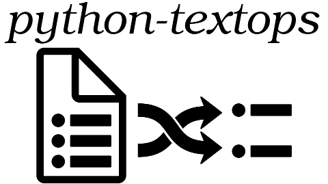

..
   Created : 2015-11-04

   @author: Eric Lapouyade

   python-textops documentation master file,

|
| `python-textops <http://python-textops.readthedocs.org>`_ provides many text operations at string level, list level or whole text level.
| These operations can be chained with a 'dotted' or 'piped' notation.
| Chained operations are stored into a single lazy object, they will be executed only when an input text will be provided.

python-textops is used into some other projects like `python-nagios-helpers <http://python-nagios-helpers.readthedocs.org>`_

.. toctree::
   :maxdepth: 1

   intro
   strops
   listops
   fileops
   wrapops
   parse
   cast
   recode
   base

Indices and tables
==================

* :ref:`genindex`
* :ref:`modindex`
* :ref:`search`

